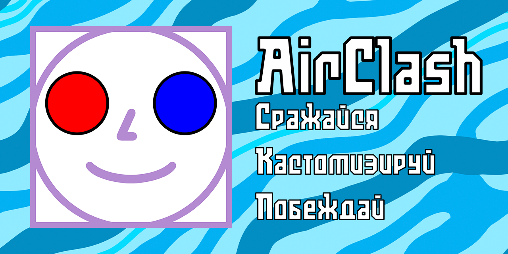
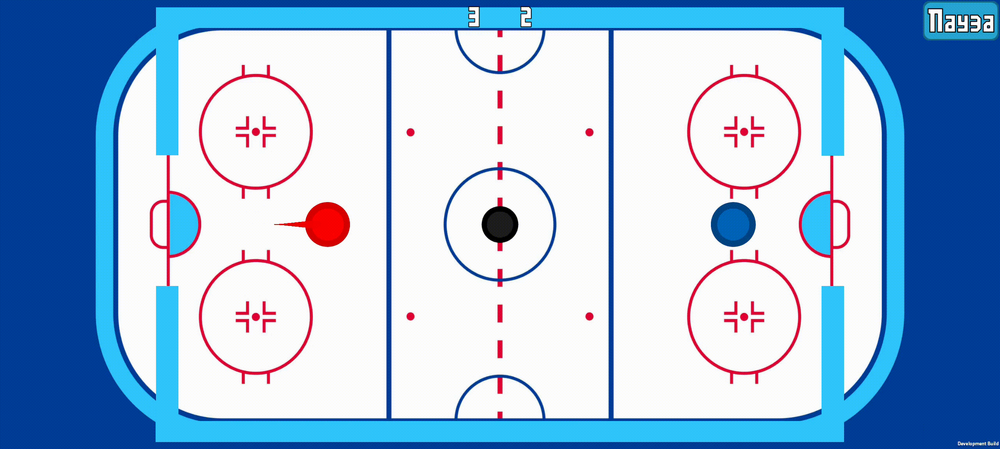
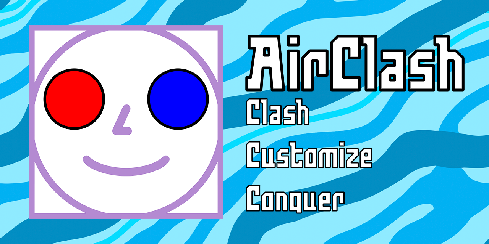

# 🎮 AirClash
**Динамичный 2D Аэрохоккей с Онлайн-Мультиплеером, Системой Прогресса и Кастомизацией**

 

[**Скачать релиз**](#-установка-и-запуск) • [**Сообщество**](#-сообщество-и-связь) • [**English Version**](#-english-version)

---

 

<h2 align="center">📸 Скриншоты и Демонстрация</h2>

  

 

  
  &nbsp;&nbsp;
  
  &nbsp;&nbsp;
  

 

 

---

 

<h2 align="center">🌟 Основные Возможности</h2>

 

### 🌐 Сетевой Мультиплеер и P2P
* **Соревновательные матчи 1v1**: Сетевая игра на базе Mirror и Epic Online Services (EOS) с минимальной задержкой.
* **Серверный расчет ЭЛО (MMR)**: Безопасный подсчет рейтинга на стороне Node.js/Firebase backend, защита от модификации данных на клиенте.
* **Лобби и Матчмейкинг**: Автоматический поиск соперников и создание приватных комнат для игры с друзьями.
* **Синхронизация и UI на поле**: Сглаживание движения шайбы и бит (Interpolation), отображение пинга в реальном времени, передача никнеймов и выбранных скинов игроков.

### 🤖 Продвинутый ИИ (Офлайн-режим)
* **4 Уровня сложности**: `Easy`, `Medium`, `Hard` и бескомпромиссный `Extreme`.
* **"Человечное" поведение**: Реалистичные ошибки при ударах, адаптирующаяся реакция и динамическое изменение агрессии в зависимости от счета.

### 🎨 Кастомизация и Экономика
* **Скины и Трейлы**: Уникальные визуальные облики бит, эффекты частиц и следы (trails) за шайбой.
* **Интеграция SoftMask**: Прозрачные маски UI для аккуратного отображения предметов в магазине и меню.
* **Кастомные звуки**: Уникальное аудиосопровождение для редких и легендарных элементов кастомизации.
* **Рулетка и Ежедневные Награды**: Система ежедневного входа с автосбросом по UTC (00:00) и рулетка с предметами разной степени редкости.

### ⚙️ Модификаторы и Система Заданий
* **Матчевые Модификаторы**: Дополнительные препятствия, туман, ускорение/уменьшение шайбы, дающие множители к получаемым монетам.
* **Динамические Квесты**: Ежедневные и постоянные задания с наградами в виде опыта (XP) и монет.
* **Система Достижений**: Цепочки ачивок с отслеживанием прогресса и получением уникальных наград.

### 💾 Облачные Сохранения и Профиль
* **Firebase Sync**: Синхронизация прогресса, монет, купленных скинов и статистики между устройствами.
* **Локальный кеш**: Поддержка офлайн-игры с последующей синхронизацией данных при появлении сети.

 

---

 

<h2 align="center">🛠️ Архитектура и Технологии</h2>

 

| Технология | Назначение в проекте |
| :--- | :--- |
| **Unity 2D** | Игровой движок, физика аэрохоккея, адаптивный UI. |
| **Mirror & EOS** | Сетевой стек для P2P-соединения и синхронизации позиций. |
| **Node.js & Firebase** | Backend для серверной валидации ЭЛО, аутентификации и сохранения профиля. |
| **DOTween** | Плавные UI-анимации, всплывающие окна и эффекты награды. |
| **TextMeshPro & SoftMask** | Четкая типографика и мягкое маскирование UI-элементов. |
| **ParrelSync** | Тестирование мультиплеера внутри одного Unity Editor в реальном времени. |

 

---

 

<h2 align="center">📦 Установка и Запуск</h2>

 

1. Перейдите в раздел [**Releases**](../../releases) текущего репозитория.
2. Скачайте последнюю версию `.apk` файла для Android.
3. Установите файл на ваше мобильное устройство или эмулятор.
4. Запустите игру и завоевывайте вершины глобального рейтинга!

 

---

 

<h2 align="center">📌 Статус и Планы Разработки</h2>

 

> **Текущий этап:** 🚀 *Стабильный релиз 1.4.0, полировка сетевого кода и баланса.*

- [x] Полная переработка UI на TextMeshPro и SoftMask
- [x] Серверный расчёт рейтинга ЭЛО и облачные сохранения Firebase
- [x] Система ежедневных наград и обновляемых квестов
- [x] Мультиплеер 1v1 (Mirror + EOS)
- [x] Лэндинг проекта на GitHub Pages
- [ ] Система друзей и приватные приглашения
- [ ] Командный режим 2v2
- [ ] Ежемесячные рейтинговые сезоны и праздничные ивенты
- [ ] Таблица лидеров (Глобальный и региональный топ)

 

---

 

<h2 align="center">🤝 Сообщество и Связь</h2>

 

📢 [**Telegram**](https://t.me/airclash_dev) &nbsp; | &nbsp; 🎬 [**TikTok**](https://www.tiktok.com/@airclash_dev) &nbsp; | &nbsp; 🎮 [**Itch.io**](https://zebraaar.itch.io/airclash) &nbsp; | &nbsp; 🌐 [**Website**](https://zebrarsgames.github.io/AirClash) &nbsp; | &nbsp; ✉️ `zebrarsgames@gmail.com`

 

---

 

<h2 align="center">👨‍💻 Автор</h2>

**Zebrar's Games** - *Идея, дизайн и разработка.*

Если вам нравится проект, не забудьте поставить **звезду ⭐** репозиторию!

 
 

---
---

 
 

# 🇺🇸 ENGLISH VERSION

 

# 🎮 AirClash
**Fast-paced 2D Air Hockey Game with Online Multiplayer, Progression System & Customization**

 

[**Download Release**](#-installation--launch) • [**Community**](#-community--links) • [**Версия на русском**](#-airclash)

---

 

<h2 align="center">📸 Screenshots & Showcase</h2>

  

 

  
  &nbsp;&nbsp;
  
  &nbsp;&nbsp;
  

 

---

 

<h2 align="center">🌟 Key Features</h2>

 

### 🌐 Network Multiplayer & P2P
* **1v1 Competitive Matches**: Low-latency real-time multiplayer powered by Mirror and Epic Online Services (EOS).
* **Server-Side Elo Rating (MMR)**: Secure rating calculation on Node.js/Firebase backend to prevent client tampering.
* **Lobbies & Matchmaking**: Automated opponent search and private custom rooms for playing with friends.
* **Synchronization & On-field UI**: Puck and paddle interpolation, real-time ping display, player nicknames, and selected skins on the field.

### 🤖 Advanced AI (Offline Mode)
* **4 Difficulty Levels**: `Easy`, `Medium`, `Hard`, and uncompromising `Extreme`.
* **Human-like Behavior**: Realistic misclicks, adaptive reaction time, and dynamic aggression adjustments based on score.

### 🎨 Customization & Economy
* **Skins & Trails**: Unique paddle cosmetics, particle effects, and puck trailing effects.
* **SoftMask Integration**: Translucent UI masking for clean presentation in shop and menu interfaces.
* **Custom Audio**: Unique sound effects for rare and legendary cosmetics.
* **Roulette & Daily Rewards**: Daily login system with UTC auto-reset (00:00) and multi-tier item roulette.

### ⚙️️ Modifiers & Quest System
* **Match Modifiers**: Additional obstacles, fog, puck size/speed tweaks providing coin multipliers.
* **Dynamic Quests**: Daily and persistent quests rewarding experience (XP) and coins.
* **Achievement System**: Achievement chains with progress tracking and unique rewards.

### 💾 Cloud Saves & Profile
* **Firebase Sync**: Cross-device synchronization of progress, coins, unlocked skins, and match stats.
* **Local Cache**: Full offline play support with automatic sync upon reconnecting.

 

---

 

<h2 align="center">🛠️ Architecture & Tech Stack</h2>

 

| Technology | Purpose in Project |
| :--- | :--- |
| **Unity 2D** | Game engine, air hockey physics, responsive UI. |
| **Mirror & EOS** | Networking stack for P2P connection and position sync. |
| **Node.js & Firebase** | Backend for server-side Elo validation, auth, and profile storage. |
| **DOTween** | Smooth UI animations, popups, and reward effects. |
| **TextMeshPro & SoftMask** | Crisp typography and soft UI element masking. |
| **ParrelSync** | Real-time multiplayer testing within a single Unity Editor. |

 

---

 

<h2 align="center">📦 Installation & Launch</h2>

 

1. Head to the [**Releases**](../../releases) section of this repository.
2. Download the latest `.apk` build for Android.
3. Install the package on your mobile device or emulator.
4. Launch the game and climb the global leaderboards!

 

---

 

<h2 align="center">📌 Development Roadmap</h2>

 

> **Current Stage:** 🚀 *Stable 1.4.0 Release, network polish, and balance tuning.*

- [x] Full UI rework with TextMeshPro and SoftMask
- [x] Server-side Elo rating calculation and Firebase cloud saves
- [x] Daily rewards and renewable quest system
- [x] 1v1 Online Multiplayer (Mirror + EOS)
- [x] Landing page on GitHub Pages
- [ ] Friends system & private lobby invites
- [ ] 2v2 Team Mode
- [ ] Monthly ranked seasons and seasonal events
- [ ] Global & Regional Leaderboards

 

---

 

<h2 align="center">🤝 Community & Links</h2>

 

📢 [**Telegram**](https://t.me/airclash_dev) &nbsp; | &nbsp; 🎬 [**TikTok**](https://www.tiktok.com/@airclash_dev) &nbsp; | &nbsp; 🎮 [**Itch.io**](https://zebraaar.itch.io/airclash) &nbsp; | &nbsp; 🌐 [**Website**](https://zebrarsgames.github.io/AirClash) &nbsp; | &nbsp; ✉️ `zebrarsgames@gmail.com`

 

---

 

<h2 align="center">👨‍💻 Author</h2>

**Zebrar's Games** - *Concept, design, and development.*

If you like this project, consider dropping a **⭐ star** on GitHub!

